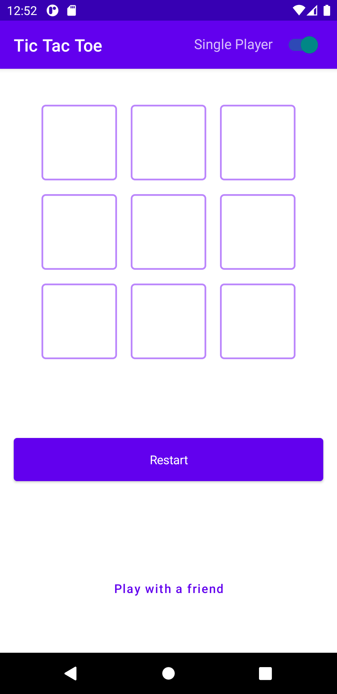
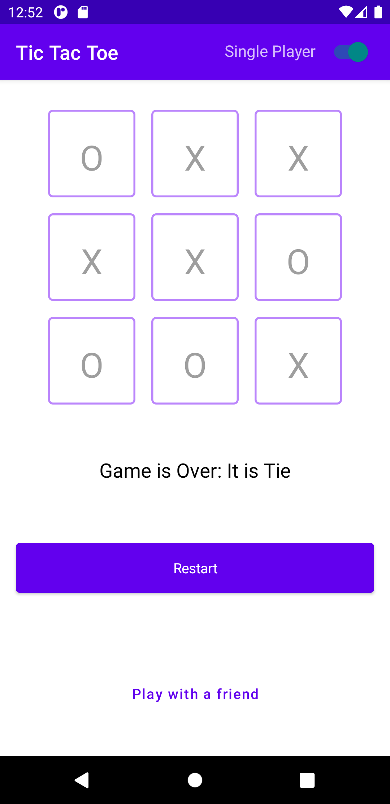
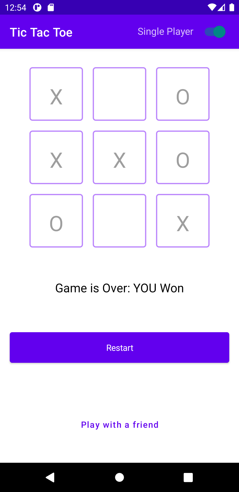

# Tic Tac Toe

Tic Tac Toe implementation (Single and Mulltiple) players with Kotlin and Jetpack Compose.


[](https://github.com/jerryOkafor/TicTacToe/blob/master/LICENSE.md)
[](https://twitter.com/Nomns0) 

## Libraries
* 100% Kotlin
* Jetpack
	* Compose - an Android Tooolkit for building native UI - less code, intuitive, accelerated develpmemt and powerful
	* ViewModel. - store and manage UI-related data in a lifecycle conscious way.

* Kotlin DSL buildSrc plugin

## Screenshots
<p align="center">




</p>


## Requirements
AndroidStudio >= 4.2 

## Find this repository useful? :heart:
Support it by joining __[stargazers](https://github.com/jerryOkafor/TicTacToe/stargazers)__ for this repository. :star: <br>
Please __[follow](https://twitter.com/Nomns0)__ lets connect as we create more amazing experience! 🤩

# License
```xml
Designed and developed by 2020 skydoves (Jaewoong Eum)

Licensed under the Apache License, Version 2.0 (the "License");
you may not use this file except in compliance with the License.
You may obtain a copy of the License at

   http://www.apache.org/licenses/LICENSE-2.0

Unless required by applicable law or agreed to in writing, software
distributed under the License is distributed on an "AS IS" BASIS,
WITHOUT WARRANTIES OR CONDITIONS OF ANY KIND, either express or implied.
See the License for the specific language governing permissions and
limitations under the License.
```